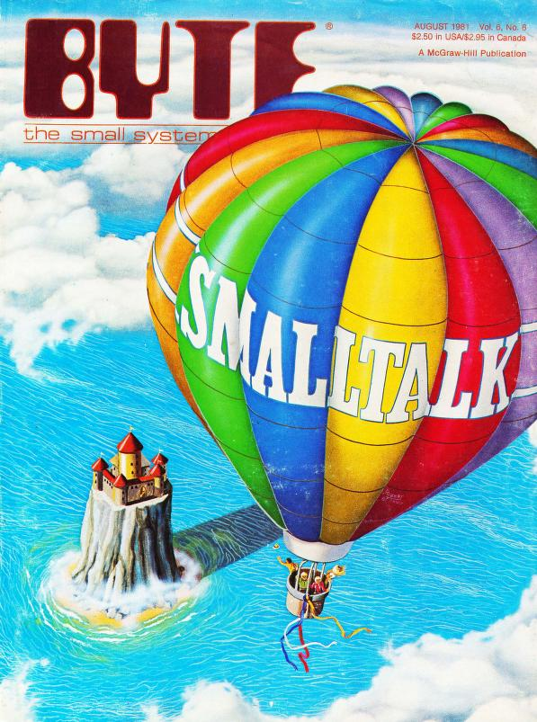

# Doc SmallTalk (VM Squeak)

## VM Squeak

Squeak est un environnement open-source, multi plateformes, descendant direct de Smalltalk-80. Le code Smalltalk est hébergé sur une machine virtuelle (VM) entièrement écrite en SmallTalk. Squeak permet d'éxecuter, de débuger, d'analyser et de changer le code source (de la VM elle même !).

Squeak se compose de 3 parties:

- une machine virtuelle (VM Squeak) dédiée à chaque OS
- une image de chaque version de Squeak (`*.image`). C'est un *screenshot* de tous les objets et de tous leurs états (état complet), au format standardisé.
- des fichiers sources de chaque image

La VM exécute une image Squeak au démarrage.

>[Scratch](https://scratch.mit.edu/) a initialement été développé [en SmallTalk avec Squeak](https://wiki.squeak.org/squeak/5833).

## Installer Squeak

Se rendre sur [le site officiel](https://squeak.org/) et [télécharger la version pour votre OS](https://squeak.org/downloads/).

Sur Ubuntu/Debian, décompresser l'archive et éxecuter `squeak.sh`. La VM vous demander de choisir un fichier `*.image` qui est une sauvegarde de tout l'environnement Squeak. Vous pouvez créer vos propres images et même modifier la VM.

## Environnement Squeak

>Tout l'environnement Squeak est écrit en SmallTalk, aussi vous pouvez vous adressez à ses composants comme à n'importe quel objet ! On peut donc envoyer un message à notre Transcript `Transcript show: 'Hello world'; cr.`, et s'adresser à notre outil de la même manière qu'à notre propre code ! 

- Transcript: système utilisé pour le loggin de messages système (comme une console)
- Workspace: comme un repo, permet de tester du code SmallTalk et de l'évaluer, ou juste d'écrire du texte (documentation, ce que vous voulez, etc.)

## Code source

## SmallTalk

Un programme SmallTalk s'écrit sous la forme de *messages* qui sont envoyés et *ce qu'il se passe* quand ils sont reçus.

### Envoyer des messages, expressions: les bases

Les envois de message sont décrits par des *expressions* qui décrivent un *receiver* (récepteur, cible), un *selector* (sélecteur, le message, équivalent *méthode* en POO moderne) et des *arguments* du selector..

Par exemple, `frame center` peut se lire "*le sélecteur `center` sans arguments est envoyé à `frame`*".

**Quand une expression est évaluée, le message est transmis au *reveiver*.**

>There is an important distinction between "methods" and "messages". A method is a body of code, while a message is something that is sent. A method is similar to a function; in this analogy, sending a message is similar to calling a function. An expression which invokes a method is called a "message sending expression." Smalltalk terminology makes a *clear distinction between* "message" and "method", but Java and C++ terminology sometimes confuses these concepts. A message-sending expression will send a message to the object. How the object responds to the message depends on the class of the object. Objects of different classes will respond to the same message differently, since they will invoke different methods. Donc, en SmallTalk tout est du *dynamic binding*, comme si tous les objets implémentaient une interface en Java. On ne travaille qu'avec des interfaces et non des implémentations. En effet, on lit plus loin "In the Smalltalk programming model, all binding is dynamic".

>Smalltalk is an un-typed language (typage dynamique, *at runtime*).

~~~smalltalk
//`frame` est le récepteur du message, `center` est le selector. On parle de *unary message*.
frame center
//`origin` est le récepeteur du message, `+` est le selector et `offset` l'argument.
origin + offset
~~~

L'expression `frame center` est un message *unaire* (unary message): il n'a pas d'argument et un opérateur *unaire*.

L'expression `origin + offset` est un message *binaire* (binary message). Un message *binaire* **a un seul argument et un sélecteur spécial dit binaire**. Les sélecteurs binaires sont +, -, /, *, == (equiv) et ~=(not equal).

L'expression `frame moveTo: newLocation` est un message *à mot-clef* (keyword message). Un tel message a un ou plusieurs arguments et un sélecteur fait de mot-clefs précédant chaque argument. Un mot clef se termine par un double-point `:`. Par exemple, dans le message `list at: index put: element` *le sélecteur est composé deux mot-clefs* `at:` et `:put` dont les arguments sont respectivement `index` et `element`. Le sélecteur de ce message est construit en concaténant les mot-clefs, soit `at:put:`.

Un argument peut être une variable ou un literal. Par exemple `45 + count`. 

Quand un message est envoyé, il invoque une méthode déterminée par la classe du récepteur. La méthode va toujours renvoyer un résultat (un objet). Le résultat d'un message peut être utilisé comme argument pour un autre message. 

Par exemple prenons le message unaire `window frame center`. **Les messages unaires sont parsés de gauche à droite**. L'expression est donc évaluée comme `(window frame) center`. `window frame` est évaluée et retourne une réponse. Ici le selecteur `frame` est envoyé à `window`, l'expression est évaluée (message transmis), `window` retourne une réponse qui reçoit ensuite le sélecteur `center`.

**Les messages binaires sont aussi parsés de gauche à droite**. Par exemple, `index + offset * 2` est équivalent à index `(+ offset) * 2`. Par exemple, `1 + 2 * 3` est évalué à `9`.

Un message entre parenthèses est envoyé **avant** les messages pas entre parenthèses. Par exemple, `1 + (2 * 3)` vaut `7`.

**Les messages unaires ont la précédence sur les messages binaires**.

Par exemple `frame center + window offset - index` s'évalue comme `(frame center) + (window offset) - index`.

Quand un mot-clef apparaît dans un message sans parenthèses, il n'y a qu'un seul message. Il n'y a pas de précédence pour les messages composés de mot-clefs. Il faut indiquer des parenthèses. Par exemple, `frame scale: (factor max: 5)`. **Les messages binaires ont la précédence sur les messages à mot-clef**.

Quand des messages unaires, binaires et à mot-clef apparaissent dans la même expression, sans parenthèses, **les messages unaires sont envoyés en premier, puis les messages binaires, et enfin les messages à mot-clefs**. Par exemple `bigFrame height: smallFrame height*2` se lit `bigFrame height: ((smallFrame height)*2)`.

### Cascade de messages

Pour envoyer plusieurs messages au même récepteur dans la même expression on utilise un point-virgule pour séparer chaque message. Par exemple `printer newLine; print: reportTitle; space; print: Date today` est une expression composée de 4 messages pour `printer`.

>C'est intéressant comment l'expressivité du langage Smalltalk donne une autre *sensation* de ce qu'*est* un *objet*. `window offset` s'écrirait aujourd'hui dans un langage de POO `window->offset`, `window.offset()` ou `window.offset`. Dans le premier cas, le langage nous montre que `window` est une boîte noire qui reçoit un message, on le voit *depuis l'extérieur*. Dans la POO moderne, le deuxième cas, on sent qu'on part *de l'intérieur de l'objet*, que l'objet nous *expose* quelque-chose. Ça ne fait pas le même *effet* dans le cerveau, on ne *pense* pas de la même manière l'objet dans les deux cas.

## Ressources

- [Squeak, site officiel](https://squeak.org/)
- [Squeak books](https://squeak.org/documentation/)
- [Back to the future The Story of Squeak, A Practical Smalltalk Written in Itself ](http://files.squeak.org/docs/OOPSLA.Squeak.html)
- [Byte Magazine Volume 06 Number 08 - Smalltalk](https://archive.org/details/byte-magazine-1981-08/page/n37/mode/2up)
- [Pharo](https://pharo.org/web/), langage/environnement/plateforme open-source purement objet, descendant direct de SmallTalk
- [Smalltalk: A White Paper Overview](https://web.cecs.pdx.edu/~harry/musings/SmalltalkOverview.html), introduction au langage et au système SmallTalk
